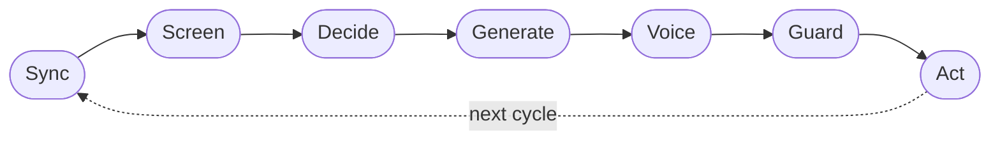
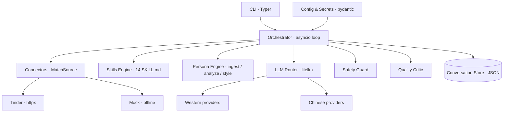

<!-- Banner placeholder: drop a hero image/GIF here once one exists, e.g.
      -->

<div align="center">

# OpenDate 💘

### Your open-source AI wingman that dates in your own voice.

Bring your own Tinder token and any LLM key. OpenDate screens dates against your
preferences, opens and carries conversations with purpose-built dating
**skills**, and rewrites every message in a **persona learned from your own posts
and chats** — consent-first, with optional human approval before anything sends.

[](https://www.python.org/downloads/)
[](LICENSE)
[](https://github.com/sumitaich1998/OpenDate/actions/workflows/ci.yml)
[](https://github.com/astral-sh/ruff)
[](CONTRIBUTING.md)
[](https://github.com/sumitaich1998/OpenDate/stargazers)

</div>

> [!WARNING]
> OpenDate is for **personal / educational use**. Tinder has **no official API** —
> the endpoints used here are unofficial, and **automating Tinder may violate its
> Terms of Service** and can break without notice. Read
> [**Responsible use & safety**](#-responsible-use--safety) before you start.

---

## Why OpenDate?

Dating apps are a part-time job: endless swiping, generic openers, threads that
die on "hey". OpenDate does the busywork **as you** — not as a generic bot.

- 🧠 **It sounds like you.** A persona learned from your real posts and chats
  re-voices every message, so it reads like your texting, not ChatGPT's.
- 🎯 **It makes the right move.** 14 dating skills (opener, banter, rapport,
  proposing a date, re-engagement…) are selected per moment and per conversation
  stage.
- 🛡️ **Consent-first by design.** A hard safety guard runs before *every* send:
  no deception, no pressure, no unwanted explicit content, and it backs off the
  instant interest fades.
- 🙋 **You stay in control.** `auto_send` is **off** by default — review and
  approve each draft, or let trusted skills run on their own. Every action is
  logged.
- 🔌 **Any LLM, anywhere.** One router speaks to **19 provider routes**, Western
  *and* Chinese, via [`litellm`](https://github.com/BerriAI/litellm).
- 🧪 **Runs with zero credentials.** A `--mock` mode + stub LLM make the whole
  pipeline demoable and **fully testable offline**.

---

## Table of contents

- [Quickstart (30s, no API keys)](#quickstart-30s-no-api-keys)
- [Real usage](#real-usage)
- [How it works](#how-it-works)
- [Feature highlights](#feature-highlights)
- [Supported LLM providers](#supported-llm-providers)
- [Skills library](#skills-library)
- [Personality & voice](#personality--voice)
- [Preferences, memory & pacing](#preferences-memory--pacing)
- [CLI reference](#cli-reference)
- [Configuration](#configuration)
- [Project layout](#project-layout)
- [Responsible use & safety](#-responsible-use--safety)
- [Roadmap](#roadmap)
- [FAQ](#faq)
- [Contributing](#contributing)
- [License](#license)

---

## Quickstart (30s, no API keys)

The offline demo runs the entire loop against mock dates and a deterministic stub
LLM — **no Tinder token, no API key, nothing is ever sent.**

```bash
git clone https://github.com/sumitaich1998/OpenDate.git
cd OpenDate
python3 -m venv .venv && source .venv/bin/activate
pip install -e ".[dev]"            # or: pip install -r requirements.txt

# Explore
python -m opendate --help
python -m opendate providers       # all 19 LLM provider routes
python -m opendate skills          # the 14 dating skills

# Run one loop cycle offline — proposes messages, sends nothing
python -m opendate --mock run --cycles 1 --no-interactive
```

A `--mock` cycle syncs fake matches, screens candidates, picks a skill per thread,
generates and re-voices a message, runs the safety guard, and **proposes** each
action:

```text
╭──────────────────────── Proposed message (not sent) ─────────────────────────╮
│ To Priya  (stage: flirting · skill: banter · quality: 1.00)                  │
│ They're matching your energy — keep the volley going.                        │
│                                                                              │
│ Bold of you to assume I'll back down from this one. Okay, one point to you — │
│ but I'm coming for it.                                                       │
╰──────────────────────────────────────────────────────────────────────────────╯
╭──────────────────────── Proposed message (not sent) ─────────────────────────╮
│ To Noah  (stage: proposing · skill: proposing-a-date · quality: 1.00)        │
│ Strong rapport — suggest meeting up.                                         │
│                                                                              │
│ This clearly needs to be settled in person. Drinks or tacos this week — say  │
│ Thursday? No worries if your week's slammed.                                 │
╰──────────────────────────────────────────────────────────────────────────────╯
```

Run the tests (also fully offline):

```bash
pytest -q
```

---

## Real usage

1. **Scaffold config + secrets:**

   ```bash
   python -m opendate init .          # writes config.yaml and .env
   ```

2. **Add your secrets** to `.env` (never commit this file):

   ```dotenv
   TINDER_AUTH_TOKEN=your-tinder-x-auth-token
   OPENAI_API_KEY=sk-...              # or any other provider key
   ```

   See [`.env.example`](.env.example) for every supported key.

3. **Edit `config.yaml`** — your preferences, which model to use, your persona
   sources, and whether to auto-send. See [Configuration](#configuration).

4. **Build your persona** from your posts/chats:

   ```bash
   python -m opendate persona build
   python -m opendate persona show
   ```

5. **Preview screening, then run the loop:**

   ```bash
   python -m opendate screen          # read-only like/pass preview
   python -m opendate run             # human-in-the-loop by default
   python -m opendate run --auto-send # let it act autonomously
   python -m opendate run --cycles 0  # run continuously
   ```

`auto_send` is **off** by default: OpenDate shows each proposed action and asks
before sending. Turn it on only when you trust it.

### Getting a Tinder token

OpenDate uses the same private endpoints the Tinder clients use, authenticated
with an `X-Auth-Token` header. Capture it from your own authenticated session
(e.g. browser dev tools on the Tinder web app → Network tab → request headers →
`X-Auth-Token`). This is unofficial and ToS-sensitive — see
[Responsible use & safety](#-responsible-use--safety).

---

## How it works

Each cycle runs the async **runtime loop** across all of your matches, isolating
errors per match so one bad thread never crashes the run:



| Step | What happens |
| --- | --- |
| **Sync** | Pull new dates, matches, and messages from the connector. |
| **Screen** | Score new candidates against your preferences (`profile-screening`). |
| **Decide** | Pick the next action + the right skill for each chat's stage. |
| **Generate** | Draft a reply with the chosen skill playbook + the LLM. |
| **Voice** | Rewrite the draft in your persona (`persona-style-transfer`). |
| **Guard** | Run consent/safety + pacing checks; optional human approval. |
| **Act** | Send / like / propose — then persist memory and log the decision. |

### Components



| Module | Responsibility | Tech |
| --- | --- | --- |
| `config` | Preferences, intent, secrets vault — never logs secrets | pydantic · `.env` |
| `llm` | One router over every provider; retries, fallback, JSON parsing | `litellm` |
| `connectors` | `MatchSource` interface; Tinder + offline Mock | `httpx` |
| `skills` | Load `SKILL.md` skills, select the right one per moment | agentskills.io |
| `persona` | Learn your voice; rewrite messages to match | persona model |
| `orchestrator` | The brain: async loop, stage machine, safety, quality, approval | `asyncio` |

---

## Feature highlights

- **Async runtime loop** across all matches with per-match error isolation and a
  priority queue (people waiting on you rank first).
- **Conversation memory + stage machine** — every thread is remembered between
  runs and tracked through `matched → opened → rapport → flirting → proposing →
  number_exchanged`, plus `stalled / ghosted → recovering`.
- **Message-quality critic** scores each draft for genericness, cringe,
  repetition, energy/length mismatch, and interview-mode over-questioning, and
  regenerates weak drafts once.
- **Pacing & anti-spam guards** — cooldowns, a rolling daily action cap, and a
  "never double-text" rule.
- **Secret-safe logging** — an active redaction filter masks tokens/keys; nothing
  in OpenDate ever logs a secret.
- **Swappable connectors** — the `MatchSource` interface makes the Tinder and
  Mock connectors interchangeable (and new apps straightforward to add).

---

## Supported LLM providers

A single `LLMRouter` (built on `litellm`) speaks to all of these. Choose one by
`key` in `config.yaml` under `llm.provider` and set the matching API key env var.
Run `python -m opendate providers` for the live table (✓ = configured).

### Western / American

| Key | Provider | Region | API key env | Default model |
| --- | --- | --- | --- | --- |
| `openai` | OpenAI | Western | `OPENAI_API_KEY` | `gpt-4o-mini` |
| `anthropic` | Anthropic | Western | `ANTHROPIC_API_KEY` | `claude-3-5-sonnet-latest` |
| `gemini` | Google (Gemini) | Western | `GEMINI_API_KEY` | `gemini-1.5-flash` |
| `xai` | xAI (Grok) | Western | `XAI_API_KEY` | `grok-2-latest` |
| `groq` | Groq (Meta Llama) | Western | `GROQ_API_KEY` | `llama-3.3-70b-versatile` |
| `together` | Together (Meta Llama) | Western | `TOGETHER_API_KEY` | `meta-llama/Llama-3.3-70B-Instruct-Turbo` |
| `mistral` | Mistral | Western | `MISTRAL_API_KEY` | `mistral-large-latest` |
| `cohere` | Cohere | Western | `COHERE_API_KEY` | `command-r-plus` |
| `bedrock` | AWS Bedrock | Western | `AWS_ACCESS_KEY_ID` | `anthropic.claude-3-5-sonnet-20240620-v1:0` |
| `azure` | Azure OpenAI | Western | `AZURE_API_KEY` | `gpt-4o` |

### Chinese

| Key | Provider | Region | API key env | Default model |
| --- | --- | --- | --- | --- |
| `deepseek` | DeepSeek | Chinese | `DEEPSEEK_API_KEY` | `deepseek-chat` |
| `qwen` | Alibaba Qwen (DashScope) | Chinese | `DASHSCOPE_API_KEY` | `qwen-plus` |
| `zhipu` | Zhipu AI (GLM) | Chinese | `ZHIPUAI_API_KEY` | `glm-4-plus` |
| `moonshot` | Moonshot (Kimi) | Chinese | `MOONSHOT_API_KEY` | `moonshot-v1-8k` |
| `baidu` | Baidu (ERNIE) | Chinese | `QIANFAN_API_KEY` | `ernie-4.0-8k` |
| `yi` | 01.AI (Yi) | Chinese | `YI_API_KEY` | `yi-large` |
| `minimax` | MiniMax | Chinese | `MINIMAX_API_KEY` | `abab6.5s-chat` |
| `hunyuan` | Tencent (Hunyuan) | Chinese | `HUNYUAN_API_KEY` | `hunyuan-standard` |
| `doubao` | ByteDance (Doubao) | Chinese | `ARK_API_KEY` | `doubao-pro-32k` |

> **19 provider routes.** Native providers route through `litellm` directly;
> OpenAI-compatible providers (most Chinese ones) use a configurable `base_url` +
> API key, with sane defaults baked in. **Adding a provider is one line** — see
> [Contributing](CONTRIBUTING.md#how-to-add-a-new-llm-provider).

---

## Skills library

Each skill is a folder under `src/opendate/skills/registry/<name>/SKILL.md` with
YAML frontmatter (`name`, `description`, `when_to_use`, `category`) and a markdown
playbook, following the [agentskills.io](https://agentskills.io) standard. Three
skills are **always-active modifiers**: `relationship-intent-matching`,
`persona-style-transfer`, and `consent-and-safety`.

| Skill | Category | Fires when | What it does |
| --- | --- | --- | --- |
| `profile-screening` | Discovery | New recommendation appears | Scores a candidate against your preferences and returns a like/pass with reasons. |
| `opener` | Opening | Fresh match, no messages yet | Writes a personalized first message from their bio, photos, and prompts. |
| `approaching` | Opening | Match made, first contact | Breaks the ice and sets the tone in the first couple of exchanges. |
| `flirting` | Building | Conversation warming up | Adds playful charm and light romantic tension, calibrated to their energy. |
| `banter` | Building | They match your energy | Witty, fast back-and-forth with light teasing and callbacks. |
| `rapport-building` | Building | Getting to know each other | Finds common ground, asks great open questions, listens actively. |
| `storytelling` | Building | Deepening the connection | Shares short, relatable anecdotes in your voice to invite reciprocal sharing. |
| `proposing-a-date` | Closing | Strong rapport detected | Suggests a concrete, low-pressure date — activity, day, place. |
| `number-exchange` | Closing | Ready to move forward | Transitions off-app to phone/socials, naturally and without pressure. |
| `re-engagement` | Recovery | No reply for N days | Revives a stalled/ghosted thread tastefully — never needy or repetitive. |
| `conversation-recovery` | Recovery | Flat or negative reply | Recovers gracefully after an awkward or mistimed message; resets the energy. |
| `relationship-intent-matching` | Meta | Modifier on every turn | Aligns tone and pacing to your intent (casual/dating/long-term). |
| `persona-style-transfer` | Meta | Post-process on every message | Rewrites any draft so it sounds unmistakably like you. |
| `consent-and-safety` | Safety | Guardrail on every action | Enforces honest, respectful, consensual behavior with hard guardrails. |

List them anytime with `python -m opendate skills` (add `-v` to print playbooks).

---

## Personality & voice

Point OpenDate at your writing and it builds a **persona profile**:

- **Inputs** — social posts (plain text, one per line, or JSON) and past chat
  exports (JSON of `{"sender", "text"}`; your own lines are picked out via
  `my_names`).
- **Signals learned** — tone & sentiment, vocabulary & slang, emoji & punctuation
  rate, message length & cadence, humor style, and go-to openers.
- **Signal blend** — social posts **40%**, past chats **35%**, stated preferences
  **25%** (tunable under `persona.blend`).
- **Hybrid analysis** — deterministic heuristics always run; an LLM refines
  tone/humor/summary when available, so it **degrades gracefully without any LLM**.
- **Style transfer** — `persona-style-transfer` rewrites every draft to match
  your voice while preserving meaning.

---

## Preferences, memory & pacing

A commented [`config.example.yaml`](config.example.yaml) ships every option.
Preferences drive screening, tone, and pacing:

| Field | Example | Drives |
| --- | --- | --- |
| `looking_for` | `long-term` (open to `dating`) | Relationship intent |
| `partner_traits` | `[witty, outdoorsy, ambitious, kind]` | Who you're drawn to |
| `dealbreakers` | `[smoking]` | Hard filters |
| `age_range` | `26 – 34` | Screening |
| `distance_km` | `25` | Screening |
| `like_threshold` | `0.55` | Min screening confidence to like |
| `voice` | `warm, curious, a little sarcastic` | Tone of messages |
| `auto_send` | `false` | Human-in-the-loop |

**Conversation memory & stages.** Each thread is persisted to a git-ignored JSON
store and tracked through a stage machine (`matched → opened → rapport → flirting
→ proposing → number_exchanged`, with `stalled / ghosted → recovering`), feeding
the resolved stage back into skill selection.

**Safety & pacing (on by default).** Cooldowns between messages, a rolling daily
action cap, a "never double-text" rule, and a back-off on disinterest / discomfort
/ possible-minor signals keep behavior respectful and non-spammy.

---

## CLI reference

| Command | Description |
| --- | --- |
| `opendate init [DIR]` | Write a starter `config.yaml` and `.env`. |
| `opendate providers` | List all 19 LLM provider routes (✓ = configured). |
| `opendate skills [-v]` | List loaded skills (optionally with playbooks). |
| `opendate persona build` | Ingest posts/chats and build the persona profile. |
| `opendate persona show` | Show the saved persona profile. |
| `opendate screen` | Preview like/pass decisions (read-only). |
| `opendate run` | Run the loop (`--cycles`, `--interval`, `--auto-send`, …). |

Global flags (before the command): `--mock`, `--config/-c`, `--env`,
`--log-level`, `--version`.

---

## Configuration

Non-secret config lives in `config.yaml`; secrets live only in `.env`. See
[`config.example.yaml`](config.example.yaml) for a fully-commented file.

```yaml
source: tinder            # or "mock"
auto_send: false          # human-in-the-loop when false
preferences:
  looking_for: long-term  # casual | dating | long-term
  partner_traits: [witty, outdoorsy, ambitious]
  dealbreakers: [smoking]
  age_range: {min: 26, max: 34}
  distance_km: 25
  like_threshold: 0.55
  voice: warm, curious, a little sarcastic
llm:
  provider: openai
  model: gpt-4o-mini
  fallbacks:
    - {provider: anthropic, model: claude-3-5-sonnet-latest}
persona:
  social_posts: [data/my_posts.txt]
  chat_history: [data/my_chats.json]
  my_names: [me, "Your Name"]
  blend: {social_posts: 0.40, past_chats: 0.35, stated_preferences: 0.25}
safety:
  require_consent_checks: true
  allow_explicit: false
  backoff_on_disinterest: true
pacing:
  cooldown_hours: 8
  reengage_after_days: 3
  max_daily_actions: 25
  never_double_text: true
```

---

## Project layout

```text
src/opendate/
  cli.py · config.py · __main__.py
  llm/           router.py · providers.py              # multi-provider LLM router
  connectors/    base.py · tinder.py · mock.py         # MatchSource interface + impls
  skills/        engine.py · registry/<skill>/SKILL.md # 14 skills
  persona/       ingest.py · analyze.py · style.py     # personality engine
  orchestrator/  loop.py · safety.py · state.py · quality.py  # loop, guards, memory, critic
  utils/         logging.py                            # rich logs + secret redaction
tests/           # fully offline pytest suite
examples/        # sample posts/chats + a walkthrough
config.example.yaml · .env.example · requirements.txt · pyproject.toml
```

---

## ⚠️ Responsible use & safety

OpenDate can automate intimate, high-stakes human interactions. Use it
thoughtfully, honestly, and with respect.

- **Consent & honesty come first.** The `consent-and-safety` guard is **on by
  default** and runs before every send: it blocks deception, coercion/pressure,
  harassment, and explicit content (unless you explicitly allow it *and* the other
  person clearly invites it), and it **backs off the moment someone signals
  disinterest or discomfort**. Don't disable it to behave in ways you wouldn't in
  person.
- **Respect the other person.** They're a real human who hasn't consented to
  talking to a bot. Be transparent if asked. Never use OpenDate to deceive,
  manipulate, harass, or pursue anyone who isn't interested.
- **Tinder's Terms of Service.** Tinder has **no official/public API**. The
  endpoints used here are unofficial and reverse-engineered. **Automating Tinder
  may violate its Terms of Service** and can lead to rate-limiting or a permanent
  ban. The unofficial API can change or break at any time.
- **Your data stays yours.** Persona artifacts and conversation state can contain
  personal data and are git-ignored. Secrets live only in `.env` and are never
  logged (an active redaction filter masks them). Keep both private.
- **Scope.** OpenDate is provided **as-is for personal and educational use**. You
  are responsible for complying with applicable laws and platform terms.

> If you wouldn't say it to someone's face, don't let an agent say it for you.

---

## Roadmap

- [ ] LLM-driven screening using the `profile-screening` playbook (heuristics
      today).
- [ ] Token refresh / SMS-OTP login flow (you supply a valid `X-Auth-Token`
      today).
- [ ] Additional connectors (Hinge, Bumble) behind the existing `MatchSource`
      interface.
- [ ] Richer analytics over the decision log (`data/decisions.jsonl`).
- [ ] A hosted, opt-in evaluation harness for message quality.

See an idea you'd like to build? [Open an issue](https://github.com/sumitaich1998/OpenDate/issues)
or a PR — good-first-issue on-ramps are in [CONTRIBUTING.md](CONTRIBUTING.md).

---

## FAQ

**Does this need an API key to try?**
No. `python -m opendate --mock run --cycles 1 --no-interactive` and the whole
test suite run fully offline with a deterministic stub LLM.

**Will it message people without my say-so?**
Only if you set `auto_send: true`. By default it proposes and waits for approval,
and the safety guard can still block a send.

**Which LLM should I use?**
Any of the 19 routes. `gpt-4o-mini`, `claude-3-5-sonnet-latest`, or
`deepseek-chat` are all good starting points; set fallbacks for resilience.

**Is automating Tinder allowed?**
It may violate Tinder's ToS and risks your account. OpenDate is for personal /
educational use — see [Responsible use & safety](#-responsible-use--safety).

**Where is my data stored?**
Persona profiles and conversation state live under git-ignored paths
(`persona.json`, `data/`). Secrets stay in `.env` and are never logged.

---

## Contributing

PRs are welcome! Start with [CONTRIBUTING.md](CONTRIBUTING.md), which covers dev
setup, running tests + lint, the project layout, and friendly on-ramps for
**adding a new dating skill** and **adding a new LLM provider**. Please also read
the [Code of Conduct](CODE_OF_CONDUCT.md) and report security issues per
[SECURITY.md](SECURITY.md).

---

## License

[MIT](LICENSE) © 2026 Sumit Aich.

---

<div align="center">

If OpenDate saved you a few awkward openers, **⭐ Star OpenDate** to help others
find it.

[⭐ Star OpenDate](https://github.com/sumitaich1998/OpenDate) ·
[🐛 Report a bug](https://github.com/sumitaich1998/OpenDate/issues/new?template=bug_report.yml) ·
[💡 Request a feature](https://github.com/sumitaich1998/OpenDate/issues/new?template=feature_request.yml)

</div>
