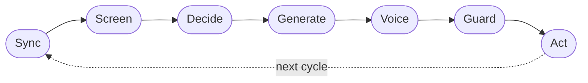

# OpenDate documentation

Welcome to the full documentation for **OpenDate** — an open-source, consent-first
"vibe-dating" AI agent. You bring your own [Tinder](connectors.md) token and an
LLM API key for [any of 19 provider routes](providers.md); OpenDate screens
potential dates, opens and carries conversations with purpose-built dating
[skills](skills.md), and rewrites every message in a [persona](persona.md)
learned from your own posts and chats.

> New here? The root [`README.md`](../README.md) is the best 5-minute overview.
> These docs go **deeper** than the README and cross-link back to it. They are
> written to be accurate to the actual code in `src/opendate/` — when in doubt,
> the source is the source of truth.

---

## Start here

1. **Just want to try it?** Follow [Getting started](getting-started.md) and run
   the keyless `--mock` quickstart — no Tinder token, no API key, nothing sent.
2. **Setting it up for real?** Read [Configuration](configuration.md) and
   [Providers](providers.md), then [Safety](safety.md) before you ever turn on
   `auto_send`.
3. **Want to understand the internals?** Start with
   [Architecture](architecture.md), then dive into the
   [Orchestrator](orchestrator.md), [Skills](skills.md), and [Persona](persona.md).
4. **Contributing?** See [Development](development.md) and the repo's
   [`CONTRIBUTING.md`](../CONTRIBUTING.md).

---

## Map of the docs

### Using OpenDate

| Page | What it covers |
| --- | --- |
| [Getting started](getting-started.md) | Prerequisites, install, the `--mock` quickstart, first real setup, verifying the install. |
| [Configuration](configuration.md) | Every `config.yaml` field with type/default/meaning, config discovery, the `.env` secrets model, and precedence. |
| [CLI reference](cli.md) | Every command (`init`, `providers`, `skills`, `persona build/show`, `screen`, `run`) and every flag, with real output. |
| [Providers](providers.md) | The LLM router, the full 19-route table, per-provider setup, fallbacks/retries/timeouts, the offline stub, and adding a provider. |

### How it works

| Page | What it covers |
| --- | --- |
| [Architecture](architecture.md) | The big picture: module map, the runtime loop, data flow, the state store + stage machine, decision logging, and diagrams. |
| [Orchestrator](orchestrator.md) | Loop internals: prioritization, per-match error isolation, the stage machine, and where state/decision logs are written. |
| [Skills](skills.md) | The `SKILL.md` format, selection logic, always-active modifiers, all 14 skills, and a "write a new skill" tutorial. |
| [Persona](persona.md) | Input formats, signals learned, the blend weights, the voice card, style transfer, graceful no-LLM degradation, and privacy. |
| [Connectors](connectors.md) | The `MatchSource` interface + data models, the Tinder connector, the mock, and an "add a connector" guide. |
| [Safety](safety.md) | The consent-and-safety gate, pacing/cooldowns, human-in-the-loop, redaction, and a "Responsible use" deep dive. |

### Help & contributing

| Page | What it covers |
| --- | --- |
| [FAQ](faq.md) | Common questions about credentials, control, providers, and data. |
| [Troubleshooting](troubleshooting.md) | Common errors (no API key, invalid token, the bare-`run` hang, empty persona…) and fixes. |
| [Development](development.md) | Dev environment, tests + lint, project layout, testing philosophy, and release notes. |
| [Glossary](glossary.md) | Definitions of OpenDate terms (match, candidate, stage, skill, modifier, voice card…). |

---

## The loop, in one diagram

Every cycle runs the async runtime loop across all of your matches, isolating
errors per match so one bad thread never crashes the run:

See [Architecture](architecture.md) for the step-by-step breakdown and a
sequence diagram of one cycle for one match.

---

## Conventions used in these docs

- File paths are relative to the repository root (e.g. `src/opendate/cli.py`).
- Command examples assume you've activated the project virtualenv; they're shown
  as `opendate ...` (the installed console script) but `python -m opendate ...`
  is exactly equivalent.
- Scripted/non-interactive examples always pass `--cycles 1 --no-interactive`
  to `run` — a bare `opendate run` blocks on an interactive confirm prompt. See
  [Troubleshooting](troubleshooting.md#a-bare-opendate-run-just-hangs).

---

## Next steps

- Brand new? → [Getting started](getting-started.md)
- Configuring? → [Configuration](configuration.md)
- Curious about internals? → [Architecture](architecture.md)
