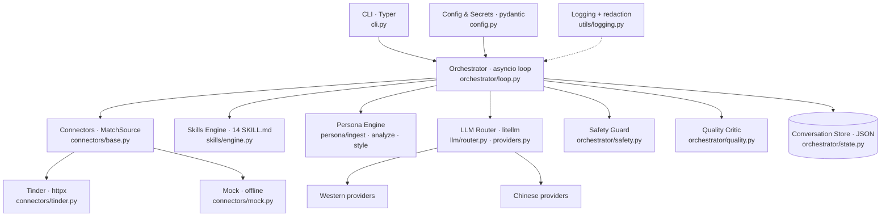
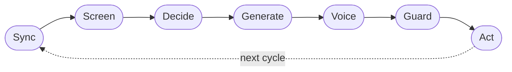
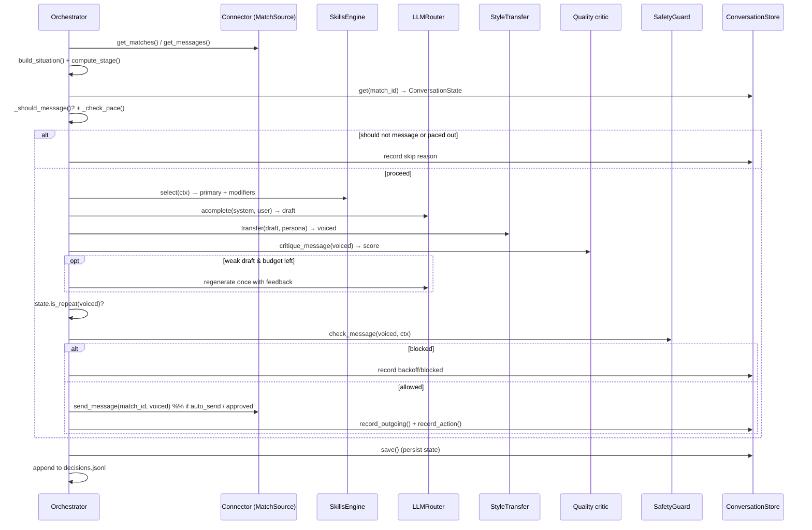
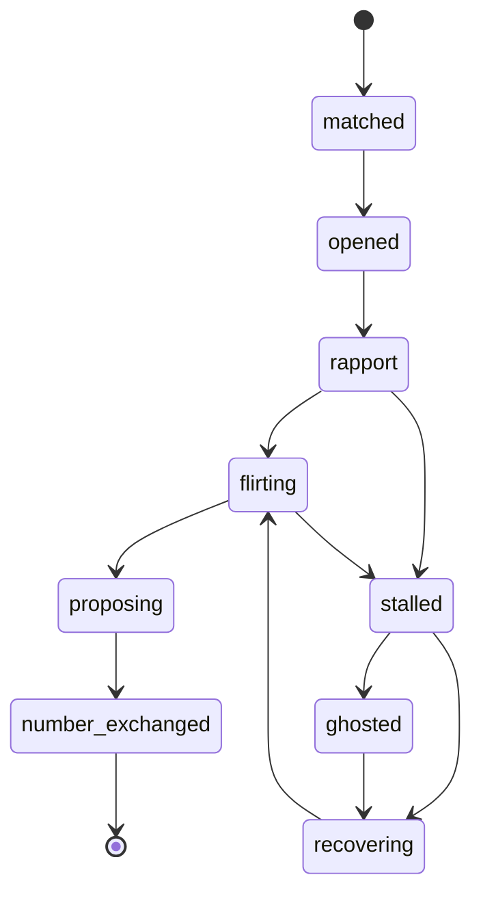

# Architecture

This page is the big-picture map of OpenDate: the modules and what they own, the
runtime loop step by step, how data flows, the conversation state store and
stage machine, and how decisions are logged. For deeper dives, follow the
cross-links into [Orchestrator](orchestrator.md), [Skills](skills.md),
[Persona](persona.md), [Connectors](connectors.md), [Providers](providers.md),
and [Safety](safety.md).

- [Component diagram](#component-diagram)
- [Module map](#module-map)
- [The runtime loop, step by step](#the-runtime-loop-step-by-step)
- [Sequence: one cycle for one match](#sequence-one-cycle-for-one-match)
- [Data flow & models](#data-flow--models)
- [Conversation state store + stage machine](#conversation-state-store--stage-machine)
- [Decision logging](#decision-logging)
- [Design principles](#design-principles)

---

## Component diagram



---

## Module map

Everything lives under [`src/opendate/`](../src/opendate/).

| Module | Key classes / functions | Responsibility |
| --- | --- | --- |
| `cli.py` | `app` (Typer), `main`, `run`, `screen`, `providers`, `skills`, `persona_*`, `init` | Command-line surface; wires config + secrets into the router, connector, skills, persona, safety, and orchestrator. |
| `config.py` | `AppConfig`, `Preferences`, `LLMConfig`, `PersonaSources`, `SafetyConfig`, `PacingConfig`, `QualityConfig`, `Secrets`, `load_config`, `load_secrets` | Validated non-secret config + the secrets vault. See [Configuration](configuration.md). |
| `llm/providers.py` | `ProviderSpec`, `ResolvedModel`, `PROVIDER_REGISTRY`, `resolve_model`, `provider_ready`, `list_providers` | The provider registry and resolution to concrete `litellm` kwargs. |
| `llm/router.py` | `LLMRouter`, `LiteLLMBackend`, `EchoBackend`, `LLMResult`, `extract_json` | One interface over every provider, with retries + fallback + usage accounting; the offline stub. See [Providers](providers.md). |
| `connectors/base.py` | `MatchSource` (Protocol), `Candidate`, `Match`, `Message`, `build_connector` | The connector interface and the data models that flow through the loop. |
| `connectors/tinder.py` | `TinderConnector`, `TINDER_BASE_URL` | The unofficial Tinder client (httpx, retry/backoff, pagination). |
| `connectors/mock.py` | `MockConnector` | Deterministic, offline match source for demos + tests. |
| `skills/engine.py` | `SkillsEngine`, `Skill`, `SkillSelection`, `SituationContext`, `ALWAYS_ACTIVE`, `parse_skill_md` | Load `SKILL.md` skills and select one per moment. See [Skills](skills.md). |
| `persona/ingest.py` | `ingest_sources`, `ingest_paths`, `IngestResult` | Read & attribute the user's writing samples. |
| `persona/analyze.py` | `PersonaProfile`, `analyze_persona`, `build_persona`, `load_profile` | Turn samples into a learned voice profile. |
| `persona/style.py` | `StyleTransfer` | Rewrite a draft into the user's voice (LLM or heuristic). See [Persona](persona.md). |
| `orchestrator/loop.py` | `Orchestrator`, `PlannedAction`, `build_situation`, `score_candidate` | The brain: the async loop, screening, prioritization, generation, acting. See [Orchestrator](orchestrator.md). |
| `orchestrator/safety.py` | `SafetyGuard`, `SafetyDecision` | The blocking consent/safety + pacing gate. See [Safety](safety.md). |
| `orchestrator/state.py` | `ConversationStore`, `ConversationState`, `ConversationStage`, `compute_stage` | Per-match memory + the stage machine. |
| `orchestrator/quality.py` | `critique_message`, `MessageCritique` | The message-quality self-critique. |
| `utils/logging.py` | `configure_logging`, `get_logger`, `register_secret`, `redact`, `RedactingFilter` | Rich logging with secret redaction. |

---

## The runtime loop, step by step

The `Orchestrator.run_once()` method implements one cycle of
**Sync → Screen → Decide → Generate → Voice → Guard → Act**. `Orchestrator.run()`
wraps it to repeat for `cycles` iterations (or forever when `cycles <= 0`),
sleeping `interval` seconds between cycles.



1. **Sync** — `connector.get_matches(count=60)` fetches matches; for any match
   without embedded messages, `connector.get_messages(match.id)` loads them.
   `connector.get_recommendations(max_screen_per_cycle)` fetches candidates to
   screen. A failure here ends the cycle cleanly (it doesn't crash the run).
2. **Screen** — each candidate is scored by `score_candidate(...)` against your
   `preferences` (hard filters + weighted soft scoring → a like/pass with a
   confidence and reasons). Screening stops early if the daily action budget is
   exhausted.
3. **Decide** — for each match, `build_situation(...)` computes a
   `SituationContext` from the message history, `compute_stage(...)` resolves the
   conversation stage, and matches are **prioritized** (people waiting on you
   rank highest). `_should_message(...)` and the pacing gate decide whether to
   act at all. The `SkillsEngine.select(...)` picks the primary skill + modifiers.
4. **Generate** — `Orchestrator._generate(...)` builds a system + user prompt
   from the selected skill playbooks, your preferences, and the persona, and
   calls `router.acomplete(...)`.
5. **Voice** — `StyleTransfer.transfer(...)` rewrites the draft into your voice
   (LLM path, or heuristics offline).
6. **Guard** — repeat detection (`state.is_repeat`), the blocking
   `SafetyGuard.check_message(...)`, and pacing checks all run. A
   `MessageCritique` may trigger a single regeneration of a weak draft.
7. **Act** — if `auto_send` is on (or you approve interactively), the message is
   sent / candidate liked. State is persisted and the decision is logged.

See [Orchestrator](orchestrator.md) for the exact prioritization, error
isolation, and pacing rules.

---

## Sequence: one cycle for one match

This is the path a single match takes through `_handle_match(...)` (omitting the
screening of fresh candidates, which is the `Screen` step):



---

## Data flow & models

Three pydantic models (in `connectors/base.py`) carry data through the loop,
regardless of which connector produced them:

- **`Candidate`** — a potential date (a recommendation) before any like/pass.
  Fields: `id`, `name`, `age`, `bio`, `distance_km`, `photos`, `prompts`,
  `interests`, `jobs`, `schools`, `raw`. `profile_text()` renders a compact,
  prompt-friendly summary.
- **`Match`** — a mutual match you can message. Fields: `id`, `person_id`,
  `name`, `photos`, `bio`, `created_at`, `last_activity_at`, `messages`, `raw`.
  Helpers: `has_messages`, `last_message`, `awaiting_their_reply`.
- **`Message`** — one chat message. Fields: `id`, `match_id`, `sender`
  (`"me"`/`"them"`), `text`, `sent_at`, `raw`. Helper: `from_me`.

The orchestrator distills a `Match` into a `SituationContext`
(`skills/engine.py`) — a flat snapshot of the moment (sentiment, interest,
playful/banter/disinterest flags, rapport score, days since last, stage, …) that
drives skill selection. A `PlannedAction` (`orchestrator/loop.py`) captures the
chosen action (`like`/`pass`/`send`/`skip`/`backoff`/`blocked`), its skill,
text, stage, confidence, and quality, and serializes to the decision log via
`to_record()`.

---

## Conversation state store + stage machine

Because OpenDate runs as a loop across many short sessions, it **remembers** each
thread. `ConversationStore` (`orchestrator/state.py`) persists per-match
`ConversationState` records and a global action log to a single JSON file
(default `data/conversations.json`). With `path=None` the store is purely
in-memory (used by tests and ephemeral runs); with a path it writes
**atomically** (temp file + replace) so a crash mid-save never corrupts it.

A `ConversationState` remembers stage, message/sent counts,
`followups_without_reply`, the last outgoing/their text, the last sent time, and
a capped history of recent outgoing messages (normalized) used to avoid repeats.

The **stage machine** (`compute_stage(...)`) resolves a thread's position along
the natural dating arc from cheap, deterministic signals:



The full `ConversationStage` enum is: `matched`, `opened`, `rapport`,
`flirting`, `proposing`, `number_exchanged`, `stalled`, `ghosted`, `recovering`,
`closed`. The resolved stage is fed back into [skill selection](skills.md). See
[Orchestrator → Stage machine](orchestrator.md) for the exact transition rules.

---

## Decision logging

Every decision is logged two ways (`Orchestrator._record_decision`):

1. A structured `INFO` log line (target, stage, kind, skill, confidence,
   quality, sent).
2. When the store is **persistent** (i.e. a `run` with a `data_dir`, not the
   in-memory test store), a JSON record is appended to
   `data/decisions.jsonl` — an auditable trail you can inspect or analyze later.

A decision record looks like:

```json
{"ts": "2026-06-08T...Z", "kind": "send", "target_id": "match-priya",
 "target": "Priya", "stage": "flirting", "skill": "banter", "confidence": 0.8,
 "quality": 1.0, "sent": false, "blocked": false, "reason": "...", "text": "..."}
```

See [Orchestrator → Inspecting state & logs](orchestrator.md#inspecting-state--logs).

---

## Design principles

- **Offline-first.** The mock connector + stub LLM (`EchoBackend`) make the whole
  pipeline runnable and testable with zero credentials. Anything new should be
  exercisable offline.
- **Heuristics are authoritative for safety & quality.** An LLM may *refine* a
  decision but must never *un-block* what the heuristics blocked.
- **Graceful degradation.** Persona analysis, style transfer, skill tie-breaks,
  and safety/quality reviews all fall back to deterministic behaviour when no
  real LLM is available.
- **Per-match isolation.** One bad thread (parse error, network blip) never
  crashes the cycle.
- **Secrets never logged.** A redaction filter masks tokens/keys everywhere.

---

## Next steps

- **The loop in depth** → [Orchestrator](orchestrator.md)
- **How skills get chosen** → [Skills](skills.md)
- **How your voice is learned & applied** → [Persona](persona.md)
- **The data source interface** → [Connectors](connectors.md)
