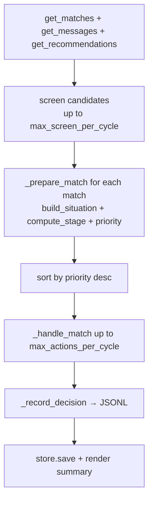
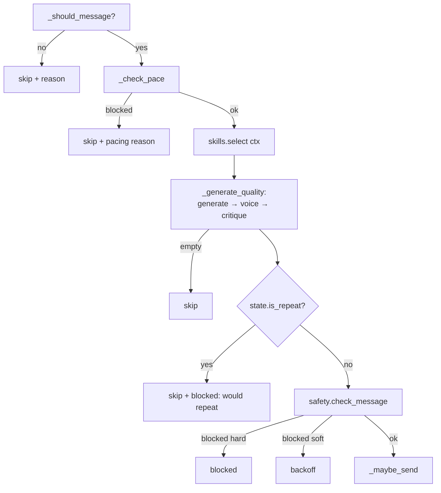
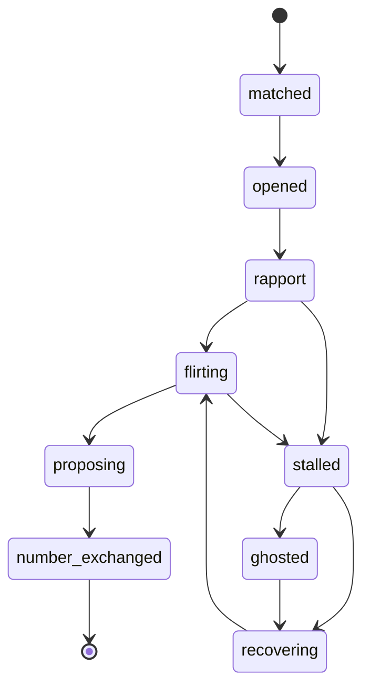

# Orchestrator

The orchestrator is OpenDate's brain. It runs the async runtime loop across all
your matches each cycle, prioritizes who to act on, generates and re-voices
messages, enforces safety and pacing, and persists memory + a decision log. The
code is [`orchestrator/loop.py`](../src/opendate/orchestrator/loop.py), with
memory/stages in [`orchestrator/state.py`](../src/opendate/orchestrator/state.py)
and the critic in [`orchestrator/quality.py`](../src/opendate/orchestrator/quality.py).

- [The cycle: `run` / `run_once`](#the-cycle)
- [Screening](#screening)
- [Prioritization](#prioritization)
- [Per-match handling](#per-match-handling)
- [Should we message? + pacing](#should-we-message--pacing)
- [Generation + self-critique](#generation--self-critique)
- [Acting (human-in-the-loop)](#acting-human-in-the-loop)
- [Per-match error isolation](#per-match-error-isolation)
- [The stage machine](#the-stage-machine)
- [Where state & decision logs live](#where-state--decision-logs-live)
- [Inspecting state & logs](#inspecting-state--logs)

---

## The cycle

`Orchestrator.run(cycles=1, interval=None)` repeats `run_once()` for `cycles`
iterations (or forever when `cycles <= 0`), printing a rule per cycle and
sleeping `interval` seconds (default `poll_interval`) between them.

`run_once()` implements one pass of **Sync → Screen → Decide → Generate → Voice →
Guard → Act**:

1. **Sync** — `get_matches(count=60)`; for matches without embedded messages,
   `get_messages(match.id)`; then `get_recommendations(max_screen_per_cycle)`
   (only if that cap is non-zero). Each fetch is wrapped so a failure degrades
   gracefully.
2. **Screen** — score each candidate, stopping early if the daily budget is gone.
3. **Decide/Generate/Voice/Guard/Act** — prepare + prioritize matches, then act
   on the top ones up to `max_actions_per_cycle`.
4. **Persist + report** — save state and render the cycle summary table.



---

## Screening

For each candidate (up to `max_screen_per_cycle`), `_screen` calls
`score_candidate(candidate, preferences)`, which returns
`(decision, confidence, reasons, open_on)`:

- **Hard filters** → immediate `pass` with confidence `0.0`: any `dealbreakers`
  term present, a candidate who appears under 18, or unmet `must_haves`.
- **Weighted soft scoring** (starts at `0.5`, clamped 0–1): age-in-range
  (+0.12) / out-of-range (−0.30), distance fit (+0.08) / far (>1.5× → −0.15),
  desired `partner_traits` hits (up to +0.24), shared `interests` (up to +0.18),
  meeting specified `must_haves` (+0.1), and a non-empty bio (+0.08) / empty bio
  (−0.05). The decision is `like` when confidence ≥ `like_threshold` (default
  0.55), else `pass`. For a like, `open_on` suggests a hook (a shared interest, a
  prompt, or the bio).

Screening actions then go through `_act_swipe`: with `auto_send` they execute
immediately; otherwise a **proposed pass is auto-skipped** (logged, no prompt),
and a proposed like is shown as a panel and (if interactive) confirmed before
liking. Executed swipes count against the daily action budget. The read-only
[`screen` command](cli.md#screen) uses the same `score_candidate` without acting.

---

## Prioritization

After syncing, every match is turned into `(match, ctx, state, priority)` by
`_prepare_match` and **sorted by priority descending**, so the per-cycle budget
targets the best opportunities first. `_priority(ctx)` returns:

| Situation | Priority |
| --- | --- |
| Their message is unanswered, high interest | `1.05` |
| Their message is unanswered | `1.00` |
| Ready for a date | `0.90` |
| Fresh match (no messages yet) | `0.80` |
| We messaged last and it's stalled (≥ `reengage_after_days`) | `0.50` |
| Disinterest or negative sentiment | `0.30` |
| We messaged last, still waiting (not stalled) | `0.10` |
| They asked to stop (`hard_stop`) | `0.00` |

In short: **people waiting on you rank highest**; threads where you'd be
double-texting rank lowest; a hard stop sinks to the bottom.

---

## Per-match handling

For each prioritized match (until `acted` reaches `max_actions_per_cycle`),
`_handle_match` produces one `PlannedAction`. `PlannedAction.kind` is one of:

| `kind` | Meaning |
| --- | --- |
| `like` / `pass` | Screening decision on a candidate. |
| `send` | A message to send/propose. |
| `skip` | Nothing to do (waiting, paced out, empty draft, duplicate). |
| `backoff` | A soft safety block — ease off rather than send. |
| `blocked` | A hard safety block — never send. |

Only non-`skip` actions count toward the per-cycle action budget. The flow inside
`_handle_match`:



---

## Should we message? + pacing

`_should_message(match, ctx)` gates whether to act at all:

| Situation | Result |
| --- | --- |
| No messages yet | send — "fresh match — time for an opener" |
| They asked to stop (`hard_stop`) | skip — "they asked to stop — backing off" |
| We sent last, idle ≥ `reengage_after_days` | send — "stalled ~Nd — re-engage" |
| We sent last, `never_double_text` on | skip — "waiting on their reply (won't double-text)" |
| We sent last, `never_double_text` off | send — "following up" |
| Their message is unanswered | send — "their message is unanswered" |

If it should send, `_check_pace` runs the [pacing gate](safety.md#pacing-cooldowns-daily-cap-no-double-text):
it computes the per-match cooldown remaining (`pacing.cooldown_hours` since the
last send) and calls `SafetyGuard.check_pacing(...)` with that, the
`followups_without_reply` count, and the daily budget left. A pacing block → skip.

---

## Generation + self-critique

`_generate_quality` runs **generate → voice → critique**, regenerating once if a
draft is weak (controlled by [`quality`](configuration.md#quality)):

1. `_generate` builds a system prompt (the selected skill's combined playbook,
   your preferences brief, the persona `style_brief()` + exemplars, quality rules,
   stage/skill hints) and a user prompt (recipient, bio, the recent conversation,
   their latest message, lines to avoid, and any critique feedback), then calls
   `router.acomplete(...)`.
2. `StyleTransfer.transfer(draft, persona)` re-voices it (see
   [Persona](persona.md#style-transfer)).
3. `critique_message(...)` scores the voiced draft 0–1 (penalizing genericness,
   pick-up-line cringe, pushiness, repetition, interview-mode over-questioning,
   and energy/length mismatch; rewarding grounding in their words). See
   [`quality.py`](../src/opendate/orchestrator/quality.py).

The number of attempts is `1 + max_regenerations` when `self_critique` is on. It
keeps the **best-scoring** attempt and stops early once a draft passes
(`score ≥ min_score`). The chosen draft's quality score appears in the cycle
summary's `Q` column.

---

## Acting (human-in-the-loop)

`_maybe_send` decides whether the chosen message actually goes out:

- With `auto_send`, it sends immediately via `connector.send_message(...)`.
- Otherwise it prints a "Proposed message (not sent)" panel and, if interactive,
  asks to confirm. A non-TTY/piped confirm is treated as "no", so nothing sends.

On a successful send, `_execute_send` records the outgoing text in the
conversation state (updating cooldown + repeat history), increments
`followups_without_reply`, and records an action against the daily budget. A send
failure is logged and isolated — it won't crash the cycle.

---

## Per-match error isolation

The loop is built so **one bad thread never crashes the run**:

- The whole **Sync** step is wrapped: a `get_matches` failure ends the cycle
  cleanly with an empty list; a per-match `get_messages` failure is logged and
  skipped; a `get_recommendations` failure is logged.
- Each **candidate** in screening is handled in its own `try`/`except` — a bad
  candidate is skipped, not fatal.
- Each **match** in the act phase is wrapped: an exception becomes a `skip`
  action with `reason="error: ..."` (carrying the stage), logged and recorded,
  and the loop continues.
- Persistence and the decision-log append are best-effort (failures are logged at
  warning/debug, never raised).

---

## The stage machine

`compute_stage(ctx, previous, proposed_date, number_shared)` resolves a thread's
position along the dating arc from cheap, deterministic signals (side-effect
free, identical online and offline). The full `ConversationStage` enum is:
`matched`, `opened`, `rapport`, `flirting`, `proposing`, `number_exchanged`,
`stalled`, `ghosted`, `recovering`, `closed`.

Resolution order (first match wins):

| Condition | Stage |
| --- | --- |
| No messages | `matched` |
| A number/handle was exchanged (`number_shared`) | `number_exchanged` |
| We sent last & idle ≥ `reengage_after_days`, and previously stalled/recovering | `recovering` |
| We sent last & idle ≥ `reengage_after_days` (idle ≥ 3× → ghosted) | `stalled` / `ghosted` |
| Disinterest or negative sentiment | `recovering` |
| A date was proposed (`proposed_date`) or we're ready for one | `proposing` |
| Banter, playful, or rapport ≥ 0.55 | `flirting` |
| ≥ 3 messages | `rapport` |
| Otherwise | `opened` |



`proposed_date` is true when we've already suggested meeting/asked for a number
in the thread; `number_shared` is true when a phone number or off-app handle has
appeared. The resolved stage is stored on the `ConversationState` and fed back
into [skill selection](skills.md).

---

## Where state & decision logs live

Both paths derive from [`data_dir`](configuration.md#top-level-fields) (default
`data/`, git-ignored):

- **Conversation memory** → `state_path()` = `<data_dir>/conversations.json`.
  Managed by `ConversationStore`, which persists each match's `ConversationState`
  plus a global action log. Writes are **atomic** (temp file + replace). With
  `path=None` (tests/ephemeral runs) the store is purely in-memory and nothing is
  written.
- **Decision audit log** → `decisions_path()` = `<data_dir>/decisions.jsonl`.
  `_record_decision` appends one JSON object per action — but **only when the
  store is persistent** (a real `run`), keeping tests clean.

A `ConversationState` remembers: `stage`, `message_count`, `sent_count`,
`followups_without_reply`, `last_action`, `last_skill`, `last_decision_reason`,
`last_outgoing_text`, `last_their_text`, `last_seen_message_id`, `last_sent_at`,
`first_seen_at`, `last_updated`, and a capped `outgoing_history` (normalized) used
for repeat detection. The daily action log keeps timestamps and prunes anything
older than 48h on save.

A decision record looks like:

```json
{"ts": "2026-06-08T16:25:18.123456+00:00", "kind": "send",
 "target_id": "match-priya", "target": "Priya", "stage": "flirting",
 "skill": "banter", "confidence": 0.8, "quality": 1.0, "sent": false,
 "blocked": false, "reason": "They're matching your energy — keep the volley going.",
 "text": "Bold of you to assume I'll back down from this one. ..."}
```

---

## Inspecting state & logs

Run a real (or mock) loop, then look under `data/`:

```bash
# Generate some state + decisions offline
opendate --mock --config examples/config.demo.yaml run --cycles 1 --no-interactive

# Pretty-print the latest decisions (one JSON object per line)
tail -n 5 data/decisions.jsonl | python -m json.tool

# Inspect remembered conversation state
python -m json.tool < data/conversations.json
```

The on-screen **cycle summary** table (`Cycle plan (dry-run — nothing sent)` in
dry-run mode) shows each action's kind, who, stage, skill, quality (`Q`), status
(sent / blocked / skipped / proposed), and a detail snippet — a quick read of
what happened that cycle. Set `--log-level DEBUG` for verbose router/usage logs
(secrets are still redacted).

---

## Next steps

- **The signals & stage feed skill choice** → [Skills](skills.md)
- **Generation re-voices via the persona** → [Persona](persona.md)
- **What the safety/pacing gates block** → [Safety](safety.md)
- **The full module map** → [Architecture](architecture.md)
