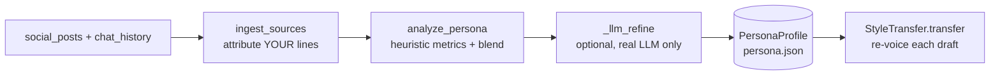

# Persona & voice

OpenDate's defining feature is that it texts **in your voice**, not a generic
bot's. It learns a persona from your real writing (social posts + past chats),
distills it into a profile, and uses that to re-voice every message. The engine
is three modules: [`persona/ingest.py`](../src/opendate/persona/ingest.py)
(read & attribute samples), [`persona/analyze.py`](../src/opendate/persona/analyze.py)
(measure & model the voice), and [`persona/style.py`](../src/opendate/persona/style.py)
(rewrite drafts).

- [Pipeline overview](#pipeline-overview)
- [Accepted input formats](#accepted-input-formats)
- [Signals learned](#signals-learned)
- [The blend (40 / 35 / 25)](#the-blend)
- [The voice card & style brief](#the-voice-card--style-brief)
- [Style transfer](#style-transfer)
- [Graceful no-LLM degradation](#graceful-no-llm-degradation)
- [Privacy of artifacts](#privacy-of-artifacts)
- [Worked example](#worked-example)

---

## Pipeline overview



`build_persona(sources, voice, router, save_path)` runs ingest → analyze →
(optional) LLM refine, and optionally saves the result. The orchestrator loads a
cached profile from `persona.profile_path` if it exists, otherwise builds one on
the fly.

---

## Accepted input formats

Configured under [`persona`](configuration.md#persona). `ingest_paths(...)`
handles each file by extension; **missing files are skipped with a warning** so
the engine degrades gracefully.

### Social posts (`persona.social_posts`)

- **Plain text** (`.txt`, or anything not `.json`): one post/message per
  non-empty line.
- **JSON** (`.json`): a list of strings, or a list of objects (see chat shapes
  below — objects without a `sender` are taken as the user's own text).

### Chat history (`persona.chat_history`)

JSON, in any of these shapes (handled by `_extract_texts_from_json`):

- A top-level `{"messages": [...]}` wrapper (the inner list is used).
- A list of strings.
- A list of objects, where the text is read from the first present of
  `text` / `message` / `content` / `body`, and the sender from the first present
  of `sender` / `from` / `author` / `user` / `name`.

```json
[
  {"sender": "Alex", "text": "haha bold of you to assume we'll disagree"},
  {"sender": "Maya", "text": "fight me 🌮"}
]
```

### Self-attribution (`persona.my_names`)

Chat exports contain both sides of a conversation; the persona should reflect
**you**, so only your lines are kept. `my_names` lists your name(s)/handle(s).
A line is treated as yours when its sender (case-insensitively):

- matches or contains one of `my_names`, **or**
- is one of the built-in self-aliases: `me`, `self`, `you`, `user`, `sent`,
  `outgoing`, **or**
- is empty/absent (an unattributed line is assumed to be yours).

In the bundled demo, `my_names: [me, Alex]` means lines from `Alex` are treated
as "you".

---

## Signals learned

`analyze_persona(...)` measures the following from your samples (the heuristic
`_Metrics` over each source), producing a `PersonaProfile`:

| Signal | Profile field | What it captures |
| --- | --- | --- |
| Tone | `tone` | Your stated `voice` (or a sensible default). |
| Humor style | `humor_style` | Derived from your `voice` words + slang/ellipsis/exclaim patterns. |
| Cadence | `cadence` | Short/medium/long based on average words per message. |
| Vocabulary | `vocabulary` | Your most characteristic non-stopword tokens. |
| Slang/filler | `slang` | Recognized slang/filler you use (lol, ngl, tbh, vibe, …). |
| Emoji | `emojis`, `emoji_rate` | Your favorite emoji + how often you use them. |
| Go-to openers | `go_to_openers` | Your common first-three-word openings. |
| Exclamation rate | `exclamation_rate` | How often you use `!`. |
| Question rate | `question_rate` | How often you ask questions. |
| Ellipsis habit | `ellipsis_user` | Whether you lean on `...`/`…`. |
| Lowercase ratio | `lowercase_ratio` | How often you text in all-lowercase. |
| Length | `avg_message_words`, `avg_message_chars` | Your typical message size. |
| Exemplars | `exemplars` | Representative real lines used as few-shot voice examples. |
| Provenance | `sources`, `blend`, `generated_with_llm` | Counts per source, the blend used, and whether an LLM refined it. |

Exemplars are chosen deterministically by `_pick_exemplars(...)`: it prefers
conversational chat lines of texty length (3–40 words, sweet spot 5–22), rewards
lines carrying your signature slang/emoji or a question, dedupes, and favours
chats over social posts.

---

## The blend

Signals from your three sources are combined with configurable weights
(`PersonaBlend`), defaulting to the OpenDate blueprint:

- **social posts — 40%** (`social_posts: 0.40`)
- **past chats — 35%** (`past_chats: 0.35`)
- **stated preferences — 25%** (`stated_preferences: 0.25`)

Whatever you set is **normalized to sum to 1.0**, so any positive numbers work.
At analysis time the weights are renormalized over the sources you actually have
signal from (e.g. if you provide only social posts, that source carries the full
weight); if you provide no samples at all, the profile rests on your stated
`voice`/preferences.

Tune it under [`persona.blend`](configuration.md#personablend):

```yaml
persona:
  blend:
    social_posts: 0.40
    past_chats: 0.35
    stated_preferences: 0.25
```

---

## The voice card & style brief

`PersonaProfile` renders two summaries:

- **`voice_card()`** — a compact, at-a-glance card (shown by `persona show`):

  ```text
  🗣  Tone: warm, curious, a little sarcastic
  😄  Humor: sarcastic, warm
  ✍️  Cadence: medium-length texts (~16 words)
  #️⃣  Emoji: rarely; normal case
  💬  Says: ...
  ⭐  Sounds like: <a real exemplar line>
  ```

- **`style_brief()`** — a fuller, prompt-ready description (tone, humor, cadence,
  emoji frequency, punctuation habits, slang, characteristic words, go-to
  openers, sample lines). This is what's injected into the generation and
  style-transfer prompts. `exemplar_block()` provides the few-shot example lines.

---

## Style transfer

`StyleTransfer.transfer(draft, persona)` (the `persona-style-transfer` skill's
runtime) re-voices a draft while **preserving its meaning and intent exactly**:

- **LLM path** (real router): the model rewrites the draft using the
  `style_brief()`, the `persona-style-transfer` playbook as guidance, and the
  exemplar lines — matching length, emoji habits, casing, and slang, never adding
  facts or changing the ask. The result is cleaned of code fences, surrounding
  quotes, and "Sure, here's…" prefaces.
- **Heuristic path** (no/stub router, or on LLM error): light, meaning-preserving
  touches — mirror a strongly-lowercase texter, adjust trailing `!`/`.` to match
  your exclamation habit, and add/remove a favorite emoji to match your emoji
  rate.

---

## Graceful no-LLM degradation

The persona engine is a **hybrid**: the heuristics always run and stand on their
own. `_llm_refine(...)` only refines `tone`/`humor_style`/`summary`/`vocabulary`/
`slang` (and sets `generated_with_llm = True`) when a real, non-stub router is
supplied and returns parseable JSON; any failure logs a warning and keeps the
heuristic profile. Under `--mock`, refinement is skipped entirely, so
`persona build` reports `LLM-refined: False` and the output is fully
deterministic.

---

## Privacy of artifacts

Your persona is personal data and stays local:

- The learned profile is saved to `persona.profile_path` (default `persona.json`;
  the demo uses `data/persona.json`).
- `persona.json`, `*.persona.json`, `persona/*.json`, and the whole `data/`
  directory are **git-ignored**.
- Your source posts/chats are yours — keep real exports out of version control.

See [Safety → Your data stays yours](safety.md#your-data-stays-yours).

---

## Worked example

Using the bundled samples and `examples/config.demo.yaml`
(`my_names: [me, Alex]`, `profile_path: data/persona.json`):

```bash
opendate --mock --config examples/config.demo.yaml persona build
```

```text
╭────────────────────────────── Persona profile ───────────────────────────────╮
│ Tone: warm, curious, a little sarcastic                                       │
│ Humor: sarcastic, warm                                                        │
│ Cadence: medium-length texts (~16 words/msg)                                  │
│ Emoji: rarely/never                                                           │
│ Characteristic words: from, after, three, one, worth, made, sourdough,        │
│ trail, coffee, pasta                                                          │
│ Go-to openers: finally nailed the; hot take a; spent the weekend; there is no │
│ Sample lines: Okay your bookshelf is doing a lot of heavy lifting in these    │
│ photos, I respect it | the very aggressive amount of cookbooks. are you       │
│ secretly feeding a small village? | Finally nailed the sourdough after three  │
│ sad, flat loaves. Persistence tastes like butter.                            │
╰────────────────────────────────────────────────────────────────────────────────╯
Saved persona to data/persona.json (LLM-refined: False)
```

Then inspect the saved profile any time:

```bash
opendate --mock --config examples/config.demo.yaml persona show
```

To use your own voice, point `persona.social_posts` / `persona.chat_history` at
your exports and set `persona.my_names` to the names/handles that identify you.

---

## Next steps

- **Configure persona sources & blend** → [Configuration → `persona`](configuration.md#persona)
- **How the voice is applied each cycle** → [Orchestrator](orchestrator.md)
- **The style-transfer skill** → [Skills](skills.md#always-active-modifiers)
