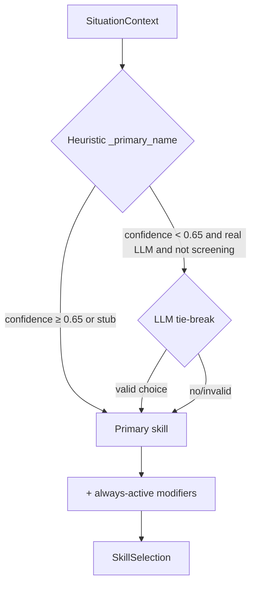

# Skills

OpenDate's dating behaviour is organized into **14 skills**, each a folder with a
`SKILL.md` following the [agentskills.io](https://agentskills.io) convention.
Eleven are *situational* (chosen per conversation moment) and three are
*always-active modifiers* layered on top. The engine lives in
[`skills/engine.py`](../src/opendate/skills/engine.py); the skills themselves are
in [`skills/registry/<name>/SKILL.md`](../src/opendate/skills/registry/).

- [The `SKILL.md` format](#the-skillmd-format)
- [All 14 skills](#all-14-skills)
- [Always-active modifiers](#always-active-modifiers)
- [How selection works](#how-selection-works)
- [Author a new skill](#author-a-new-skill)

---

## The `SKILL.md` format

A skill is a folder containing a single `SKILL.md` with **YAML frontmatter** and
a **markdown playbook body**, parsed by `parse_skill_md(...)`:

```markdown
---
name: opener
description: Writes a personalized, specific first message from the match's bio, photos, and prompts — never a generic "hey".
when_to_use: A fresh match with no messages yet, when you need to send the very first line.
category: Opening
fires_when: Fresh match, no messages yet
---

# Opener

The first message decides whether there *is* a conversation. A great opener is
specific, light, and easy to answer...
```

### Frontmatter fields

| Field | Used as | Notes |
| --- | --- | --- |
| `name` | The skill's key (`Skill.name`) | Falls back to the folder name if absent. This is the name used in selection and `_STUB_DRAFTS`. |
| `description` | `Skill.description` | Shown in `opendate skills` and injected into the playbook header. |
| `when_to_use` | `Skill.when_to_use` | Human-readable trigger description. |
| `category` | `Skill.category` | Grouping label: Discovery, Opening, Building, Closing, Recovery, Meta, Safety. |
| `fires_when` | `Skill.fires_when` | Short "fires when" label shown in the table. Falls back to `when_to_use` if absent. |

Any other frontmatter keys are preserved in `Skill.metadata`. The body becomes
`Skill.body`; `Skill.playbook()` prepends a `## Skill: <name>` header + the
description, which is what gets fed to the LLM. The loader discovers skills by
globbing `registry/*/SKILL.md`; a skill that fails to parse is skipped (with a
warning) so the rest still load.

---

## All 14 skills

Generated from the frontmatter (`opendate skills`):

| Skill | Category | Fires when | What it does |
| --- | --- | --- | --- |
| `profile-screening` | Discovery | New recommendation appears | Scores a candidate against your preferences (traits, dealbreakers, age, distance, intent) and returns a like/pass with reasons. |
| `opener` | Opening | Fresh match, no messages yet | Writes a personalized first message from their bio, photos, and prompts — never a generic "hey". |
| `approaching` | Opening | Match made, first contact | Breaks the ice and sets the tone in the first couple of exchanges, establishing warmth and momentum. |
| `flirting` | Building | Conversation warming up | Adds playful charm and light romantic tension, calibrated to their replies and energy. |
| `banter` | Building | They match your energy | Witty, fast back-and-forth with light teasing and callbacks to build chemistry. |
| `rapport-building` | Building | Getting to know each other | Finds common ground, asks great open questions, listens actively, reflects back. |
| `storytelling` | Building | Deepening the connection | Shares short, relatable anecdotes in the user's voice to invite reciprocal sharing. |
| `proposing-a-date` | Closing | Strong rapport detected | Suggests a concrete, low-pressure date — activity, day, place — with an easy yes and a graceful out. |
| `number-exchange` | Closing | Ready to move forward | Transitions off-app to phone/socials, naturally and without pressure. |
| `re-engagement` | Recovery | No reply for N days | Revives a stalled/ghosted thread tastefully — never needy, guilt-trippy, or repetitive. |
| `conversation-recovery` | Recovery | Flat or negative reply | Recovers gracefully after an awkward/mistimed/flat message; repairs tone and resets energy. |
| `relationship-intent-matching` | Meta | Modifier on every turn | Aligns tone, pacing, and topics to your intent (casual/dating/long-term) and reads their intent signals. |
| `persona-style-transfer` | Meta | Post-process on every message | Rewrites any draft so it sounds unmistakably like you — tone, vocabulary, emoji/punctuation, length, humor. |
| `consent-and-safety` | Safety | Guardrail on every action | Enforces honesty, consent, and respect; blocks deception, coercion, harassment, and unwanted explicit content; backs off on disinterest. |

Print the full playbooks with `opendate skills -v`.

---

## Always-active modifiers

Three skills are **always layered on top** of whatever primary skill is chosen,
listed in `ALWAYS_ACTIVE` (in selection order):

```python
ALWAYS_ACTIVE = (
    "relationship-intent-matching",
    "persona-style-transfer",
    "consent-and-safety",
)
```

- **`relationship-intent-matching`** — applies your `looking_for` intent to tone
  and pacing, and watches for the other person's intent signals.
- **`persona-style-transfer`** — its playbook guides the
  [style-transfer](persona.md#style-transfer) step that re-voices every draft.
- **`consent-and-safety`** — its body is passed to the
  [`SafetyGuard`](safety.md) as policy guidance (used in the optional LLM review).

`SkillSelection.combined_playbook()` concatenates the primary + modifiers (minus
any duplicate of the primary) into the LLM system prompt, so every generated
message is shaped by all of them at once.

---

## How selection works

`SkillsEngine.select(ctx, router=...)` returns a `SkillSelection` (primary +
modifiers + reason + confidence + how it was decided). The primary is chosen by
deterministic heuristics over the `SituationContext`, with an **optional LLM
tie-break** only in ambiguous mid-game cases.

### Heuristic priority (in `_primary_name`)

The first matching rule wins. Each returns `(skill, reason, confidence)`:

| Condition | Primary skill | Confidence |
| --- | --- | --- |
| `kind == "candidate"` (screening) | `profile-screening` | 0.95 |
| No messages yet | `opener` | 0.95 |
| Disinterest detected | `conversation-recovery` | 0.90 |
| We sent last & idle ≥ `reengage_after_days` | `re-engagement` | 0.90 |
| Negative sentiment | `conversation-recovery` | 0.85 |
| Ready for date & rapport ≥ 0.8 | `number-exchange` | 0.85 |
| Ready for date (otherwise) | `proposing-a-date` | 0.85 |
| They're matching energy (banter) | `banter` | 0.80 |
| Conversation playful | `flirting` | 0.75 |
| Their question, mid-thread | `rapport-building` | 0.62 |
| Early thread (just opened, 1–2 replies) | `approaching` | 0.60 |
| Deepening (≥ `deepen_after_messages` or rapport/flirting stage) | `storytelling` | 0.60 |
| Default | `rapport-building` | 0.55 |

The signals (`sentiment`, `interest`, `playful`, `banter`, `disinterest`,
`ready_for_date`, `rapport_score`, `days_since_last`, `stage`, …) are computed by
`build_situation(...)` in the orchestrator from the message history — see
[Orchestrator](orchestrator.md).

### Optional LLM tie-break

When a **real** (non-stub) router is supplied, the situation isn't screening, and
the heuristic confidence is **< 0.65**, the engine asks the model to choose among
a small set of plausible mid-game skills (`approaching`, `rapport-building`,
`storytelling`, `flirting`, `banter`). The model replies with JSON
(`{"skill": "..."}`); a valid choice overrides the primary and marks the
selection `decided_by="llm-tiebreak"`. If a chosen skill's file is somehow
missing, selection degrades to `rapport-building` (or any loaded skill) and is
marked `decided_by="fallback"`.



---

## Author a new skill

A skill is just a folder with a `SKILL.md` — a great first contribution. This
mirrors [`CONTRIBUTING.md`](../CONTRIBUTING.md#how-to-add-a-new-dating-skill).

1. **Create** `src/opendate/skills/registry/<your-skill>/SKILL.md` with
   frontmatter + a substantive playbook body:

   ```markdown
   ---
   name: your-skill
   description: One crisp sentence describing what this skill does.
   when_to_use: The situation in which this skill should fire.
   category: Building     # Discovery | Opening | Building | Closing | Recovery | Meta | Safety
   fires_when: Short label for the table
   ---
   # Your skill playbook

   Concrete do-this / not-that guidance the LLM follows. Give it a real,
   non-trivial playbook with a formula, rules, and examples (see `opener`).
   ```

2. **Wire selection** (if it should fire automatically): add a branch in
   `SkillsEngine._primary_name` keyed off the `SituationContext`. If it should be
   an **always-active modifier**, add its name to `ALWAYS_ACTIVE`.

3. **(Optional) Add a stub draft** for the offline demo in `_STUB_DRAFTS`
   (`llm/router.py`), keyed by the skill name, so `--mock` produces a sensible
   message for it.

4. **Add a test** in `tests/test_skills.py` asserting it loads and is selected
   for the right `SituationContext`, then run `pytest -q`.

The `opendate skills` table and the README skills table are generated from the
frontmatter — no extra wiring needed there.

---

## Next steps

- **The signals that drive selection** → [Orchestrator](orchestrator.md)
- **The style-transfer modifier** → [Persona](persona.md#style-transfer)
- **The safety modifier as a hard gate** → [Safety](safety.md)
